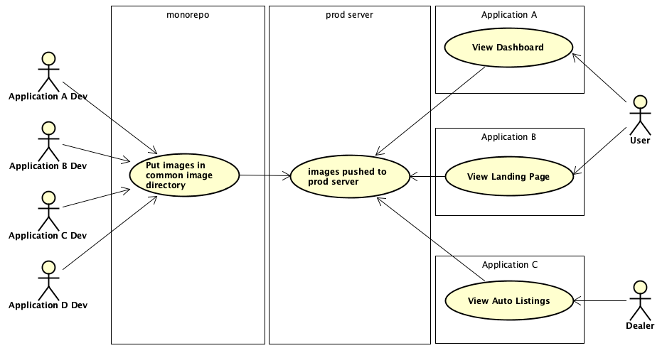
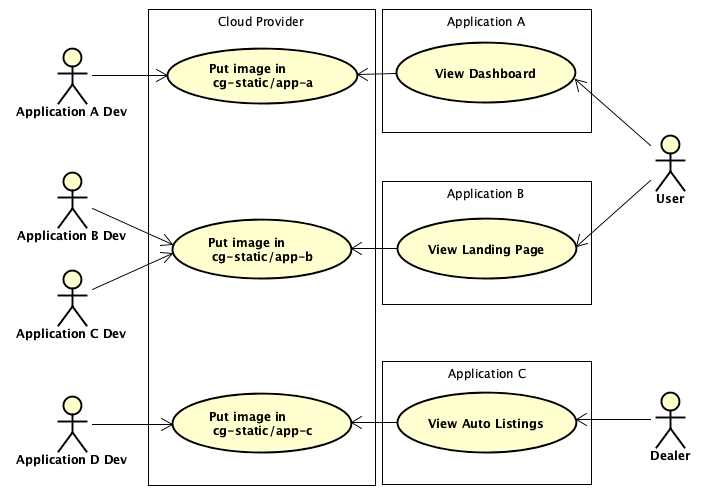
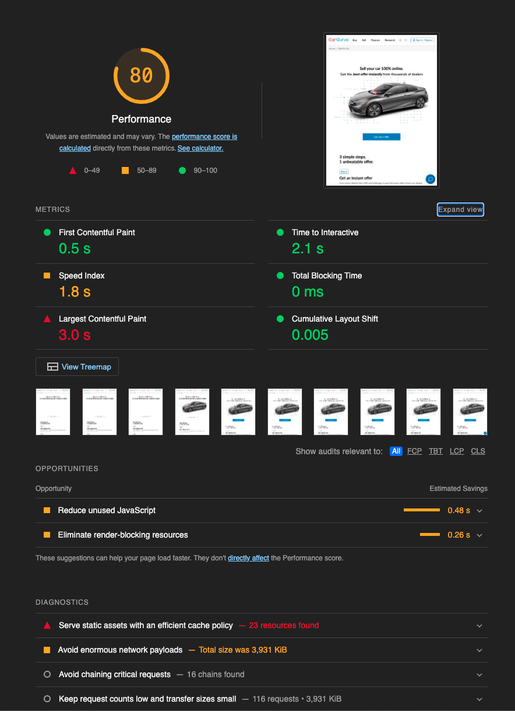
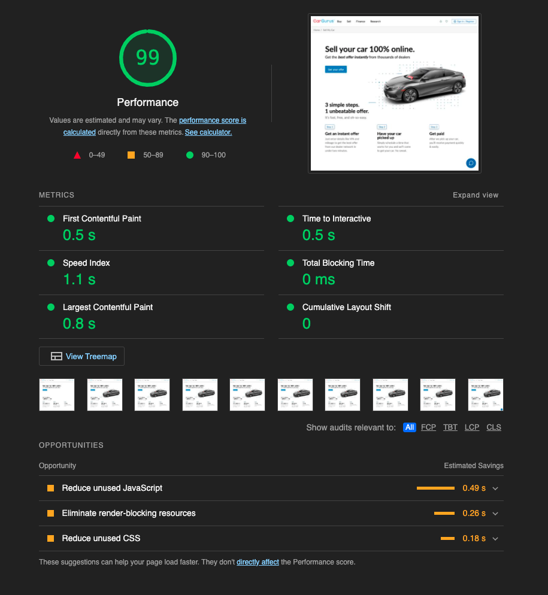

From its humble beginnings as a blog for the automotive community, the last 15 years have seen CarGurus’ offerings grow to almost two-dozen independently deployable web applications, supported by roughly 180 backend services and systems. As our product offerings have expanded, our tech stack and system architecture have had to evolve to meet the needs of our engineering community. The cornerstone of this process has been the decomposition of our monorepo into a more tightly focused multi-repo environment. This process presented a significant front-end decomposition challenge: the efficient management, hosting, and delivery of static image assets.

While we have been wildly successful at decomposing our back-end ecosystem (a fascinating topic that will be covered in a future post), our front-end application code, static assets, and build processes are still tightly coupled in many ways. Historically, devs from different application teams would store their image assets in a common directory in the CarGurus monorepo. When a new version of an application was deployed to production, the image directory was copied in its entirety to our production server. This was a reasonable approach when CarGurus was little more than search engine for auto sales, but as our application ecosystem grew to include car listings, financing pre-qualification, sales, and other tools to assist buyers and sellers, the images directory not surprisingly ballooned in size. In addition to steadily increasing build and deployment times, we were aware of the potential dangers inherent in allowing independent applications to share image assets, excepting brand-related images such as logos. 

### Isolated Asset Storage and Management

The guiding principle behind our new static asset management strategy was the belief that static assets should be isolated by independently deployable application. The practice of adding assets to the common image directory in our monorepo has been replaced by storing assets in application specific buckets hosted on our cloud services provider. Buckets are accessed via a new internal dashboard, the Static Asset Manager (SAM), which provides developers and designers an easy drag-and-drop interface for uploading and managing an application’s assets. The bloating of the common images directory has been brought to a halt, and the migration of existing image assets from our repo to the cloud has resulted in a not insignificant decrease in the size of our monorepo. 

The SAM interfaces with our cloud storage provider via a RESTful API. To streamline development, we leveraged the cloud provider’s serverless offerings for easy asset upload, modification, and deletion. The SAM was architected so that the more complex details of interacting with the cloud service REST API have been obfuscated from the front-facing interface through a set of helper classes (software design pattern aficionados will recognize this approach as the Gang of Four Facade pattern). The SAM  does not need to know or care which cloud service it is interacting with, and additional cloud providers or services can be integrated easily into the tool through the development of alternate helper class implementations of the same interface. 

### Efficient Caching and Serving of Image Assets

In addition to improving our build and deployment times, forefront in our mind was the need to efficiently version, cache, and serve our image assets. To achieve this, we applied a versioning strategy based on image fingerprinting. Image fingerprinting involves computing the checksum of an asset’s contents, and appending that hash value to the asset filename. The hash is representative of the asset’s data, and is guaranteed to be consistent and unique. Updated versions of an asset can be uploaded via the SAM and as long as the contents of the file have changed, a new checksum will be calculated. In addition to ensuring that an asset cannot be accidentally overwritten by another asset with the same name, the concatenated filename-hash provides implicit asset versioning. As such, there is no need to bust the cache when uploading an updated asset. The updated image may have the same base name, but thanks to the appended hash value, the CDN will treat it as a new resource and serve it appropriately. The previous version of the asset will still be cached, however, making it immediately available if an application ever needs to be rolled back.

### Results

The new paradigm of image hosting and management was well received by the application dev teams. In the spirit of allowing each team to manage their assets as they see fit, we did not mandate how a given team handled moving their assets to the new service. The popular approach seems to be to host new assets in the SAM, while incrementally moving older assets over as time allows. Build and deployment times have stabilized, and even decreased for some applications.

The updated caching strategy was evaluated by analyzing the quality and performance of one of our  applications using Chrome’s Lighthouse tool. Prior to the fingerprinting and isolation of the application’s image assets, Lighthouse calculated a performance score of 80. This was not great. As the following image shows, our **Time to Interactive** was greater than 2 seconds, with the **Largest Contentful Paint** requiring a snail-like 3 seconds to complete. Given that it takes seconds for a webapp user to form an opinion about a site, these values were not acceptable. Lighthouse informed us in big red letters that we needed to “serve our static assets with an efficient caching policy”. Enter the SAM.

After fingerprinting and re-hosting the static image assets in their application’s new cloud storage bucket, we ran the Lighthouse analysis again. The result was a performance score of 99. The Largest Contentful Paint required only .8 seconds, while the Time to Interactive had been reduced to a blistering .5 seconds. The results speak for themselves.

While our front-end development and asset hosting strategies continue to evolve, there is no question that this new approach to static asset management has been an overwhelming success. To quote one of the front-end devs from the product team that owned this application, “everyone in the company should be using this tool.” With adoption increasing daily, we look forward to seeing the increasing performance benefits to our users.
