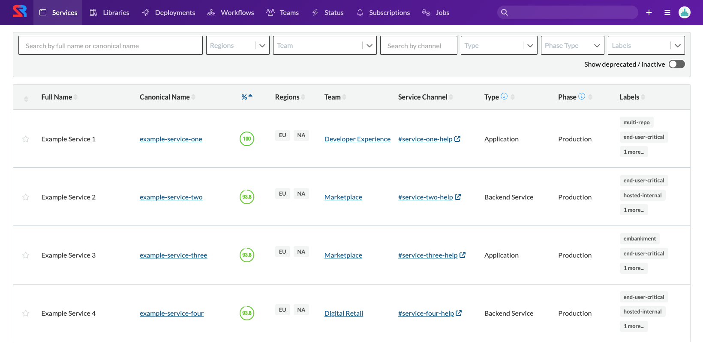
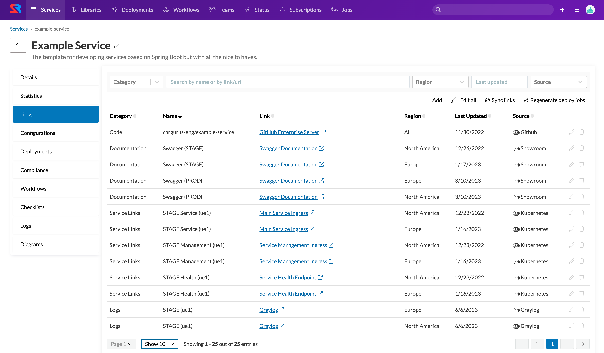
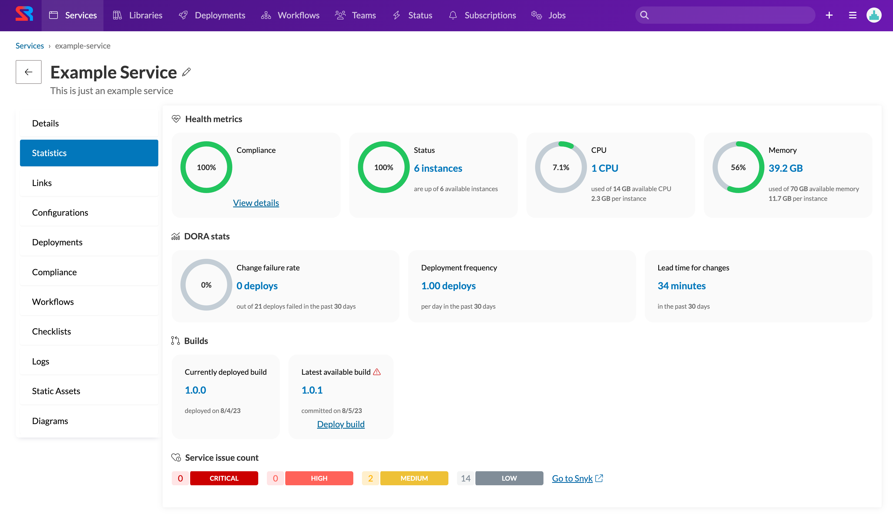
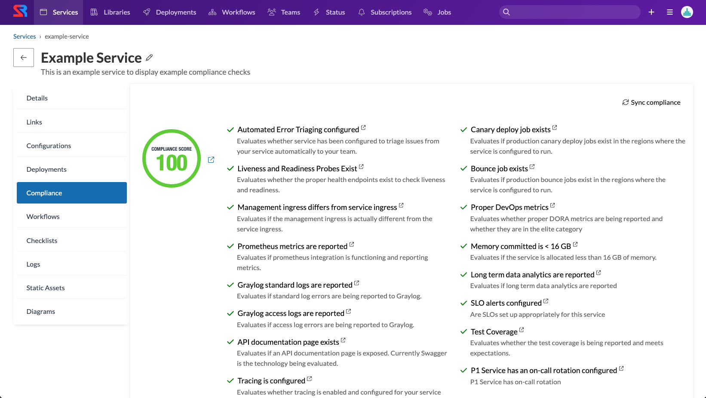
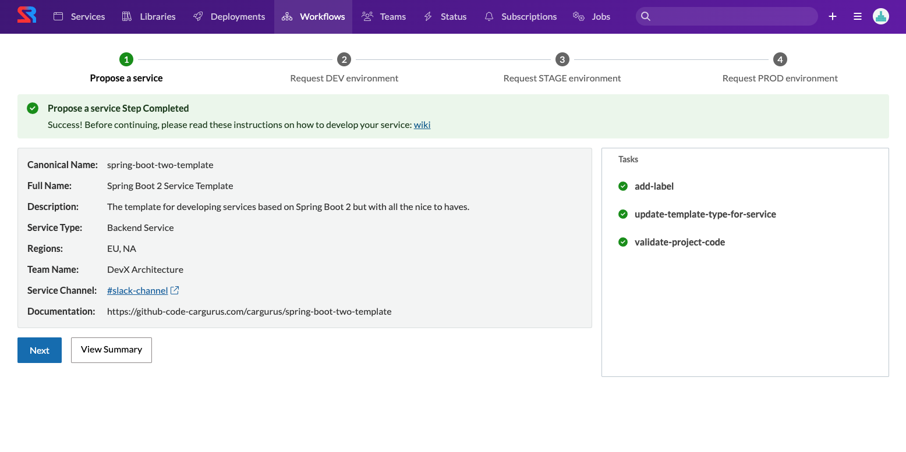
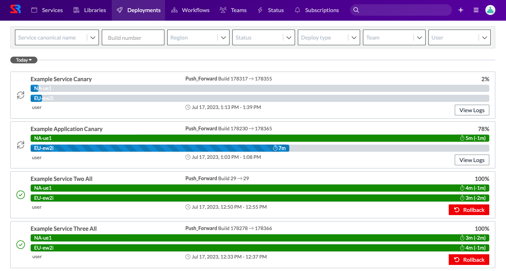

When CarGurus started our Decomposition Journey of monolith to microservices, we recognized the need for clear ownership boundaries and we created an internal tool, Showroom. What we didn’t predict at the time was that Showroom would become more than just a source of truth for ownership and an internal developer portal - it is now a centralized developer hub that enables us to work more efficiently in many different ways.

### Ownership Catalog
The original plan for Showroom was to build a service and job catalog with clear ownership for each entity. At the time, not much was available on the market that met our requirements, so we decided to build in-house. Building this was an extremely easy concept, and at the time not much was but information quickly became stale, team names changed, and ownership moved around over time. We needed to explore ways to enforce accuracy in this system. We determined that there were two best ways to achieve this:
1. Enforce registration at creation time
2.  Sync the data on a recurring basis

For services, at the time, we were operating off of a monorepo, which made it difficult to automatically sync without writing some custom code parser. Instead, we decided to introduce a pipeline governance process called RoadTests which enforced that any new services added to the repository were also registered in Showroom. This proved to be really successful and, from this point forward, all services were in our catalog.
For jobs, we decided to go with the second approach of syncing on a recurring basis. We leveraged a system to store and run our jobs, which made it easy to use their APIs to sync nightly for any changes or discovery of new jobs.
Later on, we also introduced an internal library catalog and decided to go with a combination of sync and registration at creation time approach.

 

### Data Collection
As the product evolved, we found that developers at CarGurus were looking for the same information spread across numerous systems. This led us to the idea of creating a data collection feature which automatically aggregated critical information about services that people were commonly looking for. This included data such as:
1. A link to the codebase
2. Log links for the various environments with predefined queries
3. Any associated jobs with a service
4. The build and deploy pipelines for a service
5. Links to the service’s various hosts
6. Links to the service’s API documentation

This helped developers have a single spot for critical information for their services, serving as a common bookmark aggregator for our developers. It also allowed developers to manually add links that they found useful for others, such as documentation, FAQs, critical dashboards, or user guides.

 

We then leveraged the same integration framework to get statistics about services for more real time data. These were simple data points about services, and available in other places, but by centralizing it, developers could answer these commonly asked questions with a glance:
1. How many instances are running?
2. How much memory is my service using?
3. How much CPU is my service currently using?
4. When was my service last deployed?
5. What was my service last committed to?
6. What does my service's Snyk analysis show?
7. How well is my service doing against DORA metrics?

With both of these data collection features, we are able to expand them with critical information that our developers need working day to day on various artifacts within the catalog.

 

### Platform Integration Transparency
In order to efficiently bootstrap our development, all of our services integrate with our platform offerings in some way to ensure they run smoothly in production; however, not all teams knew whether they were taking advantage of all the features we had to offer. Many teams leveraged the basic platform integrations, but there were many that had low adoption despite various communication avenues. As a result, the team created a framework called compliance checks, which enabled teams to quickly see a score for how well integrated they were with our platform. Each compliance check would analyze the service live to determine which integrations were enabled and functional. This provided the level of transparency back to our developers to determine if there was more they could take advantage of, further improving the reliability of their services.

 

### Self-service operations
One of the critical pieces of any platform team is to create a self-service experience to enable developer productivity. At CarGurus, one of the levers we introduced was a workflows framework within Showroom that enabled us to automate and streamline the developer experience when performing various platform operations.
Looking to introduce a new service, application, or library at the company? Go through Showroom. Want to transfer ownership of a service without breaking integrations and tagging across our stack? Go through Showroom.
As we mentioned earlier, ownership changes naturally happen over time. Leveraging this framework, and having Showroom be the source of truth for ownership, helped us also manage our changes over time. With this framework, we are able to keep a single pane of glass for all the platform operations you’d need to perform against the artifacts stored in our catalog. Having this in a single spot allowed developers to look there first before resorting to manual ticketing and dependencies between teams. These self-service operations allowed developers to perform actions in days or even minutes that previously would take months end-to-end.

 

### Streamlined deployments
Lastly, one of our key features in the product is visualizing and interacting with our deployments to production. We leverage traditional CI/CD tooling to do a lot of the heavy lifting, but we found even with this tooling, the developer experience allowed for far too many human errors to occur which was significantly impacting our lead time for changes. Showroom already had many of the integrations with our platform, so it was able to provide an easy button for our developers with a customized experience acting as a visual facade for our deployments at the company.
Additionally, as we continued down the journey of microservices, it became critical to have a single spot to view all of the deployments. We were actively decomposing but things weren’t fully decoupled just yet. This allowed us to have a better pulse on any potential issues that may have been caused by cross-service deployments. There were previous attempts to modify the off-the-shelf tooling we leveraged to eliminate the human errors; however, this developer hub allowed us to prevent the human errors, especially those during emergency situations.
This feature was met with incredible excitement by our developers as it streamlined their experience. We were deploying 16+ times per day across all of our services, so needless to say, it was very actively used.

 

### What’s next?
There is no shortage of ideas here internally on how to continue enhancing Showroom to live up to its vision of being a full fledged centralized developer hub and further improve our efficiency. Many of those ideas continue to be discussed within the team and are being evaluated to determine which ones add the most value. One thing we know though, is the product we have built has already proven to be a great success in helping developers at CarGurus. We are excited to expand it into more developers’ hands at the company. Maybe even one day, we’d share it with those outside of the company as well.
