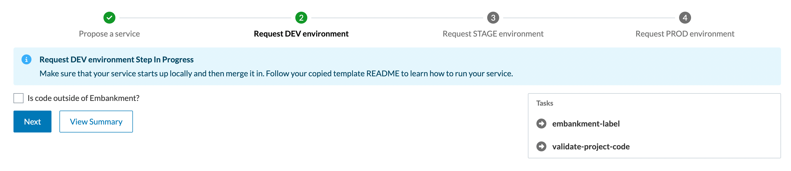

Back in early 2019, it was clear that our monolith became, well, a little too monolithic. Significant business growth put higher demands on developing against our application. We needed to do more and faster, but we had longer build and deploy times, an uptick in broken workflows and bugs, and increasingly unclear ownership lines which began to slow us down. Adding senior engineers to the teams helped, but it became clear that more drastic measures were necessary. It was time to decompose our monolith.

##What did we learn from the journey?
### 1. Define Clear Ownership - Without proper ownership boundaries, accountability will be difficult. Invest in a maintainable source of truth for ownership that will scale as the company scales.
   As we started this process, our leadership team recognized the need for clear ownership of the newly decomposed services. At the time, ownership was unclear and only catalogued in ways that became stale quickly, such as wiki or shared documents, or, in some cases, not at all.

We looked at existing service catalog tools, paid, and open source, but nothing really stood out for what we were looking to accomplish. We decided to invest into the creation of an internal tool, Showroom, which could catalog all services and jobs easily and enforce cataloguing as part of our regular development process. We integrated this with a pipeline governance process called RoadTests which added a cataloguing requirement for all new services. This proved to be very simple and effective, so we ultimately expanded it to automatically catalogue and assign ownership to all jobs as they were added to Rundeck. Showroom quickly became the single source of ownership truth for all jobs and services.

Prior to this tool, ownership conversations took a long time, often didn’t find a great home, or quickly became obsolete as shifts were made. Many services and jobs initially had to be arbitrarily assigned to teams based on "best guesses" and capacity. While we made great progress on the ownership front, ownership questions are an ongoing challenge in an organization with any longevity and staff or organizational changes. Only over time could the ownership question be refined. However, for services and jobs, we solved our immediate service ownership challenge for the sake of going to microservices. Service registration was enforced, job data automatically updated, and we knew where to go for the source of truth. This tool has evolved to become much more than a service catalog today, but we will dive into those details in another blog post.

 

### 2. Don’t try to detangle upfront – Identify at what layer(s) your application or architecture is coupled to ensure artifacts can be separated incrementally rather than as a “big bang”.
   As we were solving the ownership issue, another team was simultaneously starting decomposition by breaking out a standalone application from our monolithic site. We called this creating “Vertical Slice Applications”, or our internal code name of Car Slicer. Our goal was simple: take the existing tools that employees leverage within our monolith and break them out into a new application. As we did our analysis, we realized there were five major layers of coupling that would require separation:

* Frontend
* Cache synchronization
* Runtime dependencies
* Compile time dependencies
* Data

 

Before we dove into the coupled layers, we knew we had to decide on the primary technology to support our move towards microservices. Given that we were already a Java-heavy company, we decided our microservices would be Java and Spring based. We created a skeleton of our application to start the decoupling process.

We evaluated all coupled layers and decided to focus our first iteration on cache, runtime, and compile time dependencies. The frontend layer required a significant amount of thought leadership and our data layer wasn’t an area that we felt appropriately staffed to target at the time.

#### Cache Layer
As we were attempting to decouple our application, we realized that much of our data needed to be shared between services. We already had a cache framework in place that kept things in sync but the contract boundaries between them were not decoupled. Unfortunately, that communication was also leveraging Java Byte Serialization which further added to our coupling problem. The issue was, when one of these class contracts was changed, we had to deploy all of these services at the same time just to prevent any deserialization issues. This technical debt was very quickly identified, and we pushed the company to communicate through JSON serialized messages which allowed us to decouple producers and consumers. For new messages we mandated JSON serialization. For existing messages with few consumers, we set a deadline for change. For existing messages with many legacy consumers, the cost was too high to switch. Instead, we introduced dual serialization - two copies of the message, the original as a Java serialized byte array and the new one (for new clients) as a JSON string.

 

#### Compile Time Layer
Diving into compile time dependencies proved to be very difficult. We found there were modules that nearly all code needed in order to function. We attempted to break them into smaller modules and chunk them based on what they provided, but the calls between classes were just too coupled. We purchased a license to use a powerful downloadable analysis tool, SonarGraph, to help us analyze our compile time dependencies. It was successful in helping us better understand them, but it moved the needle forward just slightly. Here’s a visual output from the tool which displays how bad our coupling between dependencies really was:

 

#### Runtime Layer
For our runtime dependencies, we started simple by injecting a copy of the dependencies and , as we broke out code, removed unneeded ones. Sounds simple, right? We quickly found that our runtime dependencies were not properly isolated and leveraged a hierarchical structure which made it difficult to remove any dependency even when they were not needed at runtime. The difficulties were multipart:
* It was difficult to identify what was wired in at runtime
* It was difficult to identify what was used during runtime by the code of interest
* Removing dependencies from runtime configuration at lower levels of the hierarchy (because they were not used by a single leaf artifact) resulted in impacts to multiple other artifacts that used that same configuration and needed those dependencies
* Properties of the hierarchy (e.g. isolation and overriding) were leveraged so that classes could not be moved to a new level without impacting their behavior

To make sure the project progressed, we prioritized removing only what we could manage in a reasonable amount of time. Shortly after, we found a long-term solution by flattening all injected dependencies at a leaf artifact level, removing transitive imports, and creating an internal runtime dependency analysis tool which allowed us programmatically analyze which dependencies were actually leveraged or were safe to remove.

 

At this point, we could break out the code, but we weren’t able to truly accomplish having a decoupled slice. Despite this, we realized we made one significant improvement: an independently deployable application. We wanted to collect more data on the viability of this method and moved on to an external application backing our peer-to-peer business domain. This is when we launched a new application called site-p2p. Much like the first breakout, this was also not able to achieve true isolation, but provided us with more data.

Both breakouts showed us that the speed at which we could move was simply not fast enough and we couldn’t achieve the level of isolation and autonomy that we wanted. Moving applications to this model did indeed allow us to deploy independently, but provided very little build time, deploy time, or isolation benefits, proving the solution was not viable at moving the company forward. We decided to go back to the drawing board.

### 3. Ensure you have a consistent pattern - We aren’t encouraging a one-size-fits-all theme, but having a consistent pattern from the start enabled us to quickly iterate on that pattern to harden it before having multiple templates to leverage.
   By the second half of 2019 we were exploring the different approaches we could take to continue our journey. We stumbled on the Strangler Fig Pattern which, in our case, could make creating new services so easy that developers wouldn't want to add new code to our monolith. This would allow us to develop new features within microservices from the start. We introduced an initiative called v1 service model to start this work. We started with the pattern we wanted everyone to use so we would stay consistent while being able to iterate quickly as we incrementally improved. We stuck with Java and Spring and took it one step further by going with Spring Boot. We focused on backend services this time instead of full stack applications. To make it easy to bootstrap a new backend service with our platform and infrastructure connections in place, we created service-template. The template was then leveraged as a base for all new backend services that were developed during that time. We additionally enhanced Showroom to introduce Compliance Checks which automatically scored each service to ensure the bootstrapped platform connections were maintained as business logic was introduced.

 

The pattern was leveraged by a variety of developers and received a ton of positive feedback as it allowed us to get to market faster than we could in our monolith. Our build times got better as we started slim and added code instead of starting bloated and removing code. For those who were not starting fresh, we created Decomposition Recipes that helped developers with tactics they could use to break apart the various coupling layers. All of this also got us pretty significant improvements in our overall speed in bringing new services to production. The template helped reduce the 6-month average time from project kickoff to first production deploy for new services down to 75 days. Our development experience was improved with this manual process and pattern, but we knew it could still get a lot better. The key difference between this and Car Slicer was that this solution seemed viable and resulted in faster development.

### 4. Streamline your process - Where there is an opportunity to make things self-service, automated, or streamlined, do so. This alone can have massive impacts on the true speed of time to market.
   By 2020 we had great momentum with our journey to microservices. The development experience was better, but it still wasn’t where we needed to be. We knew that 75 days to get a new service into production was still incredibly slow. Since everything needed to be catalogued in Showroom, we decided to leverage the tool to kick off the service creation process. We then could automate a large portion of the manual steps that individuals got hung up on during those 75 days. We introduced a self-service framework that allowed the service teams to click a few buttons and follow guided instructions to bring their service all the way to production. The framework would automatically set up all the configured connections needed to operate the service successfully in production as well.

By doing this, we were able to take production time down to 7 days. We were able to accomplish this by eliminating the manual ticketing process between teams; leveraging our bootstrapped template; automating any builds, configurations, and deployments that we could; and having proper documentation for the steps that remained manual. We also shifted our development culture from delaying production deploys of services until they were fully mature in staging to deploying an empty service to production, in a non-exposed state, to verify it was a “walking skeleton” and then continuing to do frequent production deploys as teams iterated on new features. That culture shift also enabled us to discover production environment-specific issues earlier in our overall development time of a new service. Another massive win for the team, this improved the time to market while taking one step forward on developer experience.

 

### 5. Invest into your platform - Make sure that your platform stack is ready to handle and scale your microservices as you do.
   When we started the v1 service model, CarGurus was still operating in physical data centers. In fact, part of the reason why our initial timing to introduce new services was 6+ months was because we would have to size and order hardware to scale our services. It was clear CarGurus would greatly benefit from the agility the cloud offers, but it was going to be its own journey to get there (stay tuned for details on that journey in a future blog post). However, in 2020, we needed to discover a short term stepping stone to ultimately get us to the platform that we really wanted.

Our initial approach was running reusable hardware that would leverage Docker and containers. We then orchestrated those containers manually while we worked towards our longer term solution of running on Kubernetes and cloud. This solution got us about 9 months of usage while we provisioned Kubernetes clusters that we would migrate to instead. Once the clusters were ready, we were able to migrate our live services to Kubernetes with a well defined procedure. At the same time, we modified our workflow to automatically bring services straight to Kubernetes so that all new services could use it from the start.

One of the other reasons the platform was so important was that we wanted to ensure that we have parity across all of our environments. At the time of the project, our Production, Staging, and Development environments all ran services slightly differently. This caused problems because there were cases where issues would only surface when they ran in a specific environment. This was another one of those related areas to decomposing that initially didn’t seem like something that would need to be part of the initiative, but became critical as we moved to a more complex and robust platform under the covers.

#### Building & Pipelines
CarGurus had bought in to decomposing and moving to microservices, but we were also operating out of a monolithic repository. The move to multi-repo is another big project that is already underway; however, back in 2020, we decided to decouple that effort from our journey to microservices. Within our monorepo, we needed to be able to better isolate builds of the broken out microservices to keep build times as low as possible and only run tests that were relevant to changes being made to optimize our testing.

To bridge that gap, we swapped our monorepo build infrastructure to a technology called Bazel, which Google had created to address build challenges in their large monorepo. This allowed us to tap into some significant build speed improvements through caching and isolation through dependency analysis. Bazel made a significant dent in the runtime of our tests as well by isolating PR pipelines to run only the tests that each change request was impacting. This was critical in a highly coupled monorepo environment where everything had the potential of being impacted.

We also leveraged Bazel wrapping, and a subset of in-house built services, to auto-generate our pipelines for each of these services in a semi-decoupled way from the rest of our legacy stack. The auto-generation of our pipelines allowed us to quickly spin up new services and be consistent in the way we built and deployed them to production. This was incorporated into our automated process and was part of the reason why we were able to get down to 7 days for new services.

 

When we started on this journey we hadn’t planned for replacing our build infrastructure and creating automated pipelines as part of the scope of work. However, as we got into the project details, we realized it was critical to prevent ourselves from experiencing more pain while operating in our monorepo with microservices.

### 6. Leverage different approaches – Depending on your environment and ecosystem, it may be easier to attack the problem via different angles or approaches. It’s okay to try multiple, succeed at some, fail at others, and circle back as you have learned more.
   Going into 2021, we were feeling fairly confident in developing backend services and doing so in a way that felt comfortable remaining decoupled, but we wanted to get back to our original goal of breaking out a true vertical slice. We also wanted to start thinking architecturally about how we would set ourselves up to operate in separate repositories. We introduced a project called Embankment. This project was meant to build a one way directional wall between what we called our mainline monorepo and our new Embankment code to enable a multi-repo type environment while living within our monorepo. For example, artifacts (libraries, services, and web applications) in mainline can depend on Embankment libraries, but the reverse is not permitted. By introducing this one way wall, it forced us to start thinking about how we would re-architect our common code in a way that would remain decoupled for a long time to come. It also had the additional benefit of allowing our mainline services to swap to the decomposed Embankment libraries once they were created, slowly chipping away at their coupling as well.

With consensus around the concept of Embankment, the centralized team partnered with one of our product teams to attempt breaking out our Dealer Dashboard into a separately deployable and decoupled full stack application. Throughout the next few quarters, we worked on rewriting many of our common libraries in a more industry standard way while our partnering team focused on moving over the business logic into Embankment.

The new application was deployed in the first half of 2021 all the way to production, and we went with an API by API approach of migrating over the entire Dealer Dashboard. We saw significant build time and deploy time improvements, drastically improving our efficiency. Our biggest efficiency gain was on our deploy time, cutting it by 97%, from hours down to minutes.

We took all of these learnings and created a site-template that would be leveraged as a standard moving forward for all new applications at the company. We leveraged our self-service framework built into Showroom to streamline the go to production process and saw similar speeds for these applications as we saw with backend services. Lastly, we moved our service-template to this Embankment standard so that all new backend services were also prepared for the move to multi-repo and could remain decoupled as time went on. A number of teams even proactively migrated their mainline backend services into Embankment to take advantage of the governance and prevent coupling regressions.

 

### 7. Defer areas strategically - Many of the problem areas spanned across different platform sub-teams. Not everyone could move at the same time for capacity and prioritization reasons and expedient choices and technical debt had to be taken to unblock teams strategically.
   There was one remaining coupling problem with Embankment applications that wasn't addressed: frontend. Attacking that problem was bigger and required more thought leadership before we jumped in headfirst.

In 2022 we started that thought leadership and prepared ourselves with a number of projects that we identified as pre-requisites prior to going after the actual JavaScript code. You may have even read about one of them in our former blog posts: Better Living Through Asset Isolation.

We made significant progress on all of those pre-requisites while continuing our ongoing thought leadership of the long term architecture. Numerous cross-functional team members got together and documented where we want to be with our frontend architecture. While great process has been made towards a solution, we are still very early on within that journey.

### 8. Develop governance for the continuous journey - To maintain the standards, it’s important to automate a level of governance that will ensure the standards continue to be met. Leverage various levels of governance: blocking, informational, and manual reviews.
   So here we are today with a solid foundation around our microservices framework, a more modern platform stack, self-service automation, streamlined templates, improved build times, significantly improved deployment times, and better architected services, so what is next for our company’s technology vision? It's important to remember that this is not a one-time event, but a continuous journey that requires continuous improvement, testing, and governance.

With Embankment and the thought leadership put into our frontend stack, we are well positioned to continue on those journeys. We are even a bit further along in our multi-repo journey than this blog post lets on, but that journey likely warrants its own blog post as well. Additionally, while dents were made in build time, we still have plenty more investments to be made there. We did make some preparations on our data layer as well throughout the years, but we’ve only just started on that journey since the move to a cloud provider. Lastly, we have to prepare ourselves to avoid distributed architecture pain points through automated governance and compliance checks.

We are committed to these paths and are excited to continue dramatically improving the developer experience at the company. We persevered through some complex technical challenges, learned along the way, and have many more exciting challenges to work through. 

