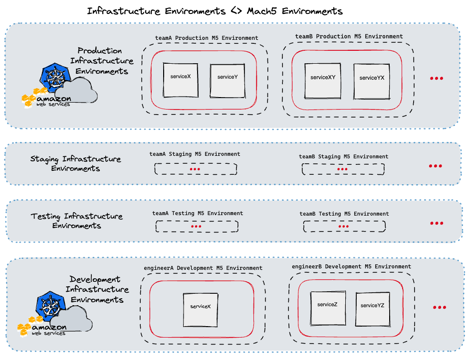

As you may expect, maintaining a continuously growing distributed system architecture does come with developer experience challenges. For instance, running the services in development may require additional services or you may need multiple backing data stores with realistic data. Also, building and deploying the microservices across environments may become more challenging as the expected configuration or underlying platform may be different. As Frank Fodera described in the last Revved blog post, [Decomposition Journey at CarGurus](https://www.cargurus.dev/Decomposition-Journey-at-CarGurus-monolith-to-microservices/ "https://www.cargurus.dev/Decomposition-Journey-at-CarGurus-monolith-to-microservices/"), over the last couple of years CarGurus has invested significantly into decomposing our monolithic services into many smaller microservices. You must be wondering how we were able to make our development team way more effective given this shift. Let me walk you through how we are supercharging the developer experience at CarGurus!

There are many tools that seek to solve some of these challenges and in some organizations, a large number of shared shell scripts fill the gaps that the tools don't fill - that's exactly what we were doing at CarGurus for a large part of our decomposition journey and we still leverage some of those scripts and tools today. However, that still leaves a lot of undesired complexity for software engineers who may need to use many tools and many scripts during the development process.

Enter Mach5 - an internal tool which serves to simplify a lot of the complexity involved with developing, configuring, and releasing microservices that are part of CarGurus' distributed systems.

## Introducing Mach5

Over the last couple of years, the Engineering Platform team at CarGurus has worked with the CarGurus product engineers to understand their typical development workflows and pains. Given what we learned, we developed Mach5. Named after the Mach Five from the 1960s manga and animated TV series "Speed Racer", its main goal is to simplify and supercharge the developer experience for our software engineers. Much like the supercharged car from "Speed Racer," Mach5 has many features designed to help the user overcome challenges - in our case, development process challenges.

From the developer's perspective, Mach5 is a command line interface that acts against a "workspace" of configuration files that coexist with the microservice's source code. Under the hood, the command line interface is running various processes locally, resolves service dependencies on demand, and triggers infrastructure operations based on the service's Mach5 configuration through a backing Mach5 registry service.

### Understanding Mach5 Environments

A key component of Mach5 is the "Environment" concept. In Mach5, microservices are deployed to environments, therefore most Mach5 operations are done within the environment scope. Each Mach5 environment serves a specific purpose. For instance, each of our development teams have their own dedicated testing, staging, and production environments (for service deployments within those stages of the release cycle). In addition, each engineer also has their own dedicated development environments.

Mach5 is able to map its own internal environments to the CarGurus' infrastructure environments when acting on users' requests. Given this, Mach5 can also provide guardrails around infrastructure environments that the typical user should not be modifying themself (e.g. production) . The below diagram illustrates this at a high level.

<div style="max-width: 720px; margin: auto;"></div>

We automate the creation of every environment based on an internal registry of development teams and software engineers. By automating this, we can guarantee that every new engineer onboarding into CarGurus and every new team that is created will have their Mach5 environments ready without any additional work on their part.

### Example use case - Mach5 deploy

By far, the most used Mach5 CLI command by developers is `mach5 deploy`. This command simplifies many of the largest challenges around developing microservices in a distributed system.

<div style="max-width: 720px; margin: auto;"></div>

As shown in the above diagram, this single command triggers a multi-step workflow handled by the Mach5 CLI client and the backing registry service. We've designed Mach5 and the deploy command in a way that allows for extending and customizing the microservice deployment process without requiring the user to know too many specifics about the underlying platform that these services are running on. Now, let's dive in deeper to understand some of the key parts of this workflow.

**Artifact build and publish**

At CarGurus, we have a variety of applications - including Java, Node, and Golang applications. We *mostly* leverage [Bazel](https://bazel.build/ "https://bazel.build/") to build and publish these applications' images. Often the first thing engineers will need to do if they wish to deploy a service for testing is set the correct Bazel tags or run the correct target. However, if you are working on multiple microservices, having to remember the various command syntaxes can increase an engineer's cognitive load when context switching.

This becomes even more challenging to do when teams need their own custom build logic or if they are using [Maven](https://maven.apache.org/ "https://maven.apache.org/") instead. Mach5 is agnostic about the build and artifact publishing systems it uses. The underlying logic of those steps can be configured through scripts by our product engineers as part of the deployment's preconditions. When an engineer runs a `mach5 deploy`, the client will automatically run those preconditions against the current code that the user has locally. The published artifacts are then used for the next step of the deploy, the workload deployment.

Following a deployment, Mach5 will also run any configured postconditions for that service. A common use case for postconditions is syncing local assets to an external file system for the deployed service to use. Preconditions and postconditions lowers the barrier to entry for engineers across teams who may want to get a service that they don't actively work on running without having to follow a series of manual steps for bootstrapping the service.

**Workload deployment**

A core principle we have for Mach5 is that its deployment is meant to be infrastructure-agnostic. Currently, CarGurus use Kubernetes to run most of our application workloads and have clusters for our production, staging, and development environments. Within each of those clusters, we associate namespaces to the various Mach5 "environments" described above. Our main use case currently is for deploying within these Kubernetes clusters but we have plans on extending Mach5 using our internal provider interface to enable users to deploy different types of workloads, such as [AWS Lambda functions](https://docs.aws.amazon.com/lambda/latest/dg/welcome.html "https://docs.aws.amazon.com/lambda/latest/dg/welcome.html").

Kubernetes can be a complex system to work with for many product engineers. There are many tools for deploying a workload to Kubernetes; including using [kubectl](https://kubernetes.io/docs/reference/kubectl/ "https://kubernetes.io/docs/reference/kubectl/") or [Helm](https://helm.sh/ "https://helm.sh/") directly. However, given the complexity of Kubernetes, it may not be safe to allow every software engineer to have access to applying changes into a Kubernetes cluster directly. With the provider interface I mentioned, Mach5 can be configured to deploy a raw Kubernetes manifest or it can take in a Helm chart and values files for the deployment.

This gives us a great chance to do some pre-deployment processing and validation and to limit the permissions down to our single Mach5 backing registry. We are also planning on supercharging this process even more by enabling Mach5 to integrate with Kubernetes operators that respond to specific [Custom Resource Definitions](https://kubernetes.io/docs/concepts/extend-kubernetes/api-extension/custom-resources/ "https://kubernetes.io/docs/concepts/extend-kubernetes/api-extension/custom-resources/").

**Service Dependencies and Delegates**

One of the biggest challenges with developing a microservice is understanding service dependencies. At CarGurus our product engineers maintain over 80 microservices and that number continues to grow. In addition, each service may need a backing data store or they may need to leverage external systems like Kafka for messages. This is where Mach5 really drives a more seamless developer experience! Before we get to that, let's revisit the "environment" concept.

At a high level, each environment ends up being a collection of deployed services. With what we call "delegation", that collection of services is conceptually expanded into a larger collection. Here is a simplified YAML representation of how a Mach5 environment is typically composed:

```yaml
name: engineerA
selectors: [development]
data:
  delegatedEnvironments:
  - name: global
    selectors: [staging]
  - name: teamA
    selectors: [staging, internal]
  deployments:
  - name: serviceA
  - name: serviceA
    selectors: [testingChange1]
  - name: serviceB
    selectors: [testingChange1]
  kubernetesData:
    cluster: dev-cluster-na
    namespace: engineerA-user-namespace
  owner: engineerA
```

As part of an individual Mach5 service's configuration, you can specify the dependencies on other services. The Mach5 registry that backs the CLI operations knows about all environments and all currently existing deployments. If it detects that service X depends on service Y, it will first check the current Mach5 environment for service Y. If it does not exist there, then it will check the delegated environments noted above to find the next closest match. All development Mach5 user environments are delegated to our staging environment.

We represent the data stores and external systems as services that can be added to specific environments so the same searching will be applied to those dependencies. Thanks to Mach5, once the workload for service X has been deployed, it routes to the identified dependent services without requiring the engineer to separately deploy all of its dependencies.

<div style="max-width: 720px; margin: auto;"></div>

As you'd imagine, this provides some great benefits. If an engineer would like to test changes to two services together, all they have to do is deploy both of those services to their environment. They can even deploy their own instance of the backing data store if they do not want to use the delegated staging data store.

At any point, they can use a `mach5 undeploy` command against their services when they are done testing or if they want to fall back to using the delegated service.

**Selectors**

Many software engineers may run into cases where they would like to do testing against one git branch, pass it off for feedback or testing, and continue additional development while they wait. That's where our selector capability comes in. Selectors allow different variants of a single service to be deployed and linked to other similar variants.

A user can specify an optional selector with any Mach5 deployment. That will follow the same flow as described above but it will keep any existing deployment without the specified selector untouched. As shown in the diagram above, the selector is also used as part of the service dependency search; so you can deploy multiple versions of a service within your environment (with differing selectors) but Mach5 will prefer the dependent services with a matching selector over deployments without one.

For Mach5 environments, we use selectors to describe the various purposes of those environments. For instance, `teamA` will likely have 3 environments as noted above. The name is always `teamA` but the various selectors would be `testing`, `staging`, or `production` to represent those stages of the release cycle.

### Additional Debugging Tools

The Mach5 CLI and the backing registry service are continuing to grow based on feedback from our internal product engineers. This has shaped Mach5 into a much more robust tool for all software engineers in the organization. In addition to managing microservice deployments, the CLI can be used to get information like available ingress hosts and logs for existing deployments.

We are continuously learning, iterating, and improving Mach5 as a means to improve our overall developer experience at CarGurus. If this is something you're interested in then I recommend checking out our [open roles](https://careers.cargurus.com/job-search-results/?parent_category=Engineering "https://careers.cargurus.com/job-search-results/?parent_category=Engineering")!