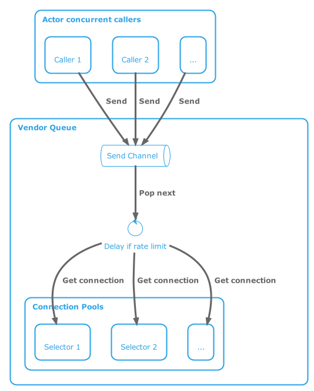

Computers have up to a dozen cpu cores which can all work in parallel (concurrently). It's hard to write code to take
advantage of that
concurrency. Additionally, every time code makes a request of an external system, it has to wait a long time
relative to computational speed for a response. The best systems will put that request to the side and
begin working on the next request or an unprocessed response. 

It's not unfathomable for a well-written program to have around
60 outstanding requests at a time. Sometimes this volume can overwhelm the systems on the other side and they can
ask your system to stop sending requests for a few seconds during which your system would typically make hundreds of
new requests. If you've written your code concurrently, it's hard to have all the
separate request processors coordinate. Naive coordination approaches will often cut concurrency by an order of
magnitude thus defeating all your hard work coding the concurrency. Failure to coordinate may provoke the remote server
to refuse to accept requests or to slow down request processing to such an extent that, once again, all your concurrency
coding is for not.

As we’ve made our system highly concurrent
using [Kotlin coroutines](https://Kotlinlang.org/docs/coroutines-overview.html),
we’ve occasionally stressed third-party APIs thus causing rate limit exceptions. Kotlin is great at concurrent
processing
with context switching on every API request, database query,
or other network call. Kotlin's dispatch mechanism allows an order of magnitude more processing stacks than there are
CPUs.

Our online advertisement generation and optimization system has billions of ads grouped into thousands of accounts
distributed over various advertising channels. Our calls to these

* request fine-grained spending and performance data for each account every hour,
* adjust bids, budgets, and other limits for every campaign (over 30,000) several times daily,
* check and update content for every ad every day.

This activity adds up to a lot of remote requests and sometimes causes the advertising channel
to send a rate-limiting exception.

Our pre-actor implementation caught these exceptions per coroutine process (processing context, call stack). It
handled them just within that call stack by delaying slightly more than whatever the error said. This meant that
sibling call stacks hitting the same API endpoint would provoke many remote servers to issue higher exceptions.
For example, GoogleAds will initially request a 15-second wait but exponentially increase that up to 15 minutes as
requests come within that cessation period. Obviously waiting 15 minutes in this high-paced environment is unacceptable.

By implementing the [actor](https://en.wikipedia.org/wiki/Actor_model) pattern to govern each remote call, we've been
able to reduce rate limit escalations to almost none without impeding concurrent processing.

## Algorithm sketch



The basic architecture is a fan-in channel, a single very simple and quick dispatcher, and a connection pool
(fan-out analog) per external service. Per external service means not the fine-grained service but whatever
granularity the remote endpoint is expecting to honor the rate limit. So, for example, in our system it's each
advertising host: Google, Facebook, MSN, etc.

Calling methods must all be suspendable (details later). The calling methods send an `ApiRequest`
object (defined below) to the fan-in channel owned by the actor. The actor iterates the channel,
delays[^1] if there's
been a rate limit exception, requests a connection from the owned connection pool or delays if one is not available, and
lastly dispatches the request to the connection within a `try..catch` block catching any rate-limiting errors but
letting other errors through.

[^1]: `delay` is a Kotlin function to swap out a process for a minimum duration allowing other processes to swap in.

### Actor code

The actor uses the obsolete but not yet replaced Kotlin `CoroutineScope.actor`. It's defined in an `abstract` class
for which there should be an implementing class per advertising host type. Implementing classes must define
`delayError(e: Exception): Long?` method which takes any and all exceptions and returns `null` if the exception
is not a rate limit or returns how many milliseconds to delay before allowing the next request.

The code must be re-entrant even though the process loop never runs simultaneously because the exception handlers
access the volatile variables. It also needs to
segregate the coroutine dispatch pools of its callers from the various actors' processing and
their connection pools. If it tries to share (say just using `Dispatchers.IO`) and the code above the callers creates
more than 64[^3] coroutine children, there will be no Dispatchers left for the actors themselves nor their async
invocations
on the connection pools.

[^3]: 64 is the predefined limit of concurrent coroutines for Kotlin's built-in singleton `Dispatchers.IO`

The main `actor` loop is:

``` Kotlin
     /**
     * Call `queue.send(ApiRequest(poolSelector) { vendorClient -> ... result })`, and then
     * you can call `APIRequest.result()` on the request to have it wait for the actor to allocate
     * a pool object, call the body you passed, and assign the result to [result()].
     */
    // Note: the channel has no opinion about the return type of ApiRequest but the sender does; however, there
    // will be many senders with different opinions for the same channel.
    @OptIn(ObsoleteCoroutinesApi::class)
    val queue: SendChannel<ApiRequest<Any>> = actor(
        // actor needs to not compete w its users otherwise it may stall if they consume all dispatchers
        queueDispatcher,
        onCompletion = QueueCompletionHandler()
    ) {
        for (request in channel) {
            if (delayMsec > 0) { // did we catch a rate limit? if so, swap for duration
                logger.debug { "Delay $delayMsec" }
                delay(delayMsec)
                delayMsec = 0 // reset after delay is done
                logger.debug { "Delay done" }
            }
            // a bit race condition vulnerable if anything can possibly claim a connection between this loop
            // and the `availableConnection` call; however, actor itself is not concurrent; so, that should be impossible.
            while (!isConnectionAvailable()) {
                logger.debug { "Waiting for connection to become available" }
                delay(WAIT_DELAY)
            }

            logger.debug { "Connection available" }

            when (val eitherConnection = availableConnection(request.poolSelector)) {
                is Either.Left -> {
                    logger.warn { "Could not get a connection for ${request.poolSelector}" }
                    request.recordException(eitherConnection.value)
                }

                is Either.Right -> {
                    val connection = eitherConnection.value
                    launch(poolDispatcher) {
                        // note this needs separate dispatcher pool from callers so that it can do work even if
                        // callers consume all threads
                        execBlockOnConnection(catchDelay(), request, connection)
                    }
                }
            }
        }
    }
```

This loop

1. gets the next request,
2. checks whether it needs to delay due to rate limit,
3. gets or waits (process swaps) for a connection from the pool,
4. launches a child coroutine, and
5. has that child execute the request on the given connection.

The code for most of the referenced symbols is collapsed below.

<details>
<summary>Code details</summary>

``` Kotlin
    companion object {
      // how many children connection processes can there be (really the connection pool capacity)
      private val poolDispatcher = Dispatchers.IO.limitedParallelism(CONNECTION_POOL_LIMIT)
    
      // how many actors can run simultaneously (more can run via process swap)
      private val queueDispatcher = Dispatchers.Default.limitedParallelism(3)
    }
    @Volatile
    protected var delayMsec = 0 // same as Atomic in Java
    
    private suspend fun execBlockOnConnection(
        catchDelay: RetryPolicy<Throwable>,
        request: ApiRequest<Any>,
        connection: C
    ) {
        try {
            retry(limitAttempts(RETRY_LIMIT) + catchDelay) {
                request.saveResult(tryRequest(connection, request.block))
            }
        } catch (e: CancellationException) {
            throw e
        } catch (e: Exception) {
            if (delayError(e) != null) {
                logger.warn(e) { "Gave up delaying" }
                request.recordException(DelayErrorHandlerFailed(e))
            } else {
                request.recordException(e)
            }
        } finally {
            logger.debug { "Returning connection to pool" }
            returnConnection(request, connection)
        }
    }

    private fun catchDelay(): suspend RetryFailure<Throwable>.() -> RetryInstruction =
    {
        if (reason is Exception && reason !is CancellationException) {
            // catch delayable error: delay whole channel and this stack. Retry this stack request
            // after delay. (would really like to requeue request but even if that was possible it 
            // could lead to infinite loops)
            delayError(reason as Exception)?.let { msec ->
                // max to protect against race conditions
                if (msec > delayMsec) delayMsec = msec
                delay(msec)
                ContinueRetrying
            } ?: StopRetrying
        } else {
            StopRetrying
        }
    }
    
    inner class QueueCompletionHandler : CompletionHandler {
        override fun invoke(cause: Throwable?) {
            closeAll() // close all children coroutines
        }
    }
```

Hopefully you can map the retry DSL to your retry mechanism.

</details>

I'm not going to go into how the pool selector works[^2] other than to mention that the model allows for pool
connection CRUD via any arbitrary key. Some APIs won't have various connections. Some will have distinct
connections per service. In the latter case, the service would be the key. Another example would be a read-only
versus read-write connection pool. The pool manager checks if
a connection of that type is available. If it's not available, but we haven't exhausted capacity, it allocates
a new connection. If we've exhausted capacity via create, but some are idle, it destroys an arbitrary idle connection
and allocates a new one for the given selector.

[^2]: Could be topic for another blog post if people ask for it.

### Calling the actor and getting results

The methods calling the `VendorQueue` should be running in their own coroutines set to suspend and swap upon
a call to the `VendorQueue`. We usually wrap the calling method in `runBlocking` rather than define it as a `suspend`
to minimize
the [colored functions requirement](https://journal.stuffwithstuff.com/2015/02/01/what-color-is-your-function/). The
code sends the request to the queue (actor) and then returns
the request's result.

`ApiRequest` and sample method for calling a specific GoogleAds service:

``` Kotlin
    /**
     * The object API which callers put into the actor's queue. Call [result] to suspend and wait for
     * the call to propagate through. If the call got an uncaught error, [result] will rethrow the error.
     * @param poolSelector if the actor should maintain different pools for various access, then this should
     *    have a non-null value. Not all actors have a poolSelector, but MSN uses read-only vs read-write. Google
     *    uses service class as pool selectors.
     * @param block what to call when the actor provides a connection.
     */
    inner class ApiRequest<R>(
        val poolSelector: T,
        val block: suspend (C) -> R,
    ) {
        private val resultHolder: CompletableDeferred<R> = CompletableDeferred()

        /**
         * Suspend waiting for the result. If there was an exception, this re-throws the exception.
         */
        suspend fun result(): R = resultHolder.await()
        fun saveResult(value: R): Boolean = resultHolder.complete(value)
        fun recordException(exception: Exception): Boolean = resultHolder.completeExceptionally(exception)
    }

    /**
    * Pass the given query to the Google search API (read-only).
    */
    fun readFromGoogle(
        externalAccountId: Long,
        query: String,
        transform: (GoogleAdsRow) -> SyncedContent
    ): List<SyncedContent> = runBlocking {
        val request = this.ApiRequest<SearchPagedResponse>(GoogleAdsServiceClient::class) { client ->
            check(client is GoogleAdsServiceClient)
            client.search(
                SearchGoogleAdsRequest.newBuilder()
                    .setCustomerId(externalAccountId.toString())
                    .setQuery(query)
                    .build()
            )
        }
        this.queue.send(
            request as VendorQueue<KClass<out BackgroundResource>, BackgroundResource>.ApiRequest<Any>
        )
        return request.result().iterateAll().map(transform)
    }
```

In the previous `actor` code, you'll see that `queue` is the actor. The actor calls `saveResult`
or `recordException`.
The `ApiRequest` really only contains the connection selector. The payload is in the block which you see in
the `readFromGoogle` example where `query` is the payload.

Note that `readFromGoogle` will rethrow any caught error other than a rate limit error.
The caller should handle all standard exceptions. It's the call to `request.result()` which rethrows the error
which `recordException`
saved into the result.

## Extensions

An obvious extension is converting to whatever replacement Kotlin provides for `actor` although it wouldn't be too
hard to replace `actor` with a `SendChannel` whose listener is the loop and it pushes to a `Channel`.

Since GoogleAds uses streamable protobuf, we implement `streamSearch` over this pattern which returns
a `Flow<GoogleAdsRow>`.
